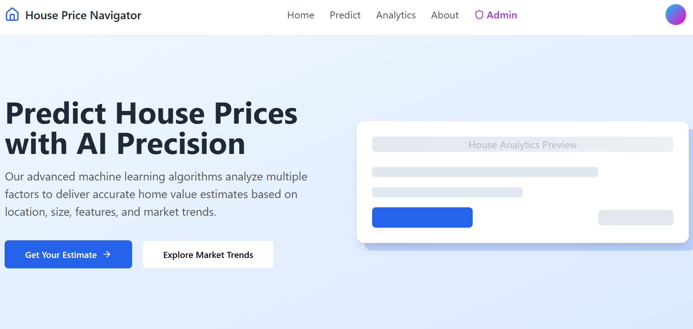

# House Price Navigator

A modern web application for predicting house prices using machine learning algorithms, featuring an intuitive UI built with React and TypeScript.

## Features

- 🏠 Property price prediction using machine learning
- 📊 Advanced analytics and market trends visualization
- 🗺️ Interactive map view with Google Maps integration
- 📱 Responsive design with mobile support
- 🎨 Modern UI with shadcn-ui components
- 🌙 Dark mode support
- 👤 User accounts and subscription management
- 📝 Blog section with property market insights
- 🔐 Admin panel for model training and user management

## Screenshots

### Home Page


### Property Price Predictor


### Admin Dashboard


## Technologies Used

This project is built with modern web technologies:

- **Vite** - Fast build tool and development server
- **TypeScript** - Type-safe JavaScript
- **React** - UI library
- **shadcn-ui** - Beautiful component library
- **Tailwind CSS** - Utility-first CSS framework
- **React Router** - Client-side routing
- **React Hook Form** - Form validation
- **Recharts** - Data visualization
- **Tanstack Query** - Data fetching and caching

## Getting Started

### Prerequisites

- Node.js (v16 or higher)
- npm or yarn

### Installation

1. Clone the repository:
```sh
git clone https://github.com/yourusername/house-price-navigator.git
cd house-price-navigator
```

2. Install dependencies:
```sh
npm install
```

3. Set up environment variables:

Create a `.env` file in the root directory:
```sh
cp .env.example .env
```

Then add your API keys to the `.env` file:
```env
VITE_MAPBOX_ACCESS_TOKEN=your_mapbox_token_here
VITE_GOOGLE_MAPS_API_KEY=your_google_maps_api_key_here
```

**Required API Keys:**
- **Mapbox Access Token**: Get yours at [https://account.mapbox.com/](https://account.mapbox.com/)
- **Google Maps API Key**: Get yours at [https://console.cloud.google.com/google/maps-apis/](https://console.cloud.google.com/google/maps-apis/)

⚠️ **Important**: Without these API keys, the map features will not function properly.

4. Start the development server:
```sh
npm run dev
```

The application will be available at `http://localhost:5173`

## Available Scripts

- `npm run dev` - Start development server
- `npm run build` - Build for production
- `npm run build:dev` - Build in development mode
- `npm run preview` - Preview production build
- `npm run lint` - Run ESLint

## Project Structure

```
├── src/
│   ├── components/     # React components
│   │   ├── admin/     # Admin panel components
│   │   ├── features/  # Feature-specific components
│   │   ├── layout/    # Layout components
│   │   └── ui/        # shadcn-ui components
│   ├── pages/         # Page components
│   ├── hooks/         # Custom React hooks
│   ├── lib/           # Utility functions
│   ├── types/         # TypeScript type definitions
│   ├── utils/         # Helper utilities
│   └── data/          # Static data files
├── public/            # Static assets
└── index.html         # HTML entry point
```

## Environment Variables

This project requires the following environment variables:

| Variable | Description | Required |
|----------|-------------|----------|
| `VITE_MAPBOX_ACCESS_TOKEN` | Mapbox API token for map features | Yes |
| `VITE_GOOGLE_MAPS_API_KEY` | Google Maps API key for location services | Yes |

### Getting API Keys

**Mapbox Access Token:**
1. Sign up at [https://account.mapbox.com/](https://account.mapbox.com/)
2. Navigate to your account dashboard
3. Copy your default public token or create a new one

**Google Maps API Key:**
1. Go to [Google Cloud Console](https://console.cloud.google.com/)
2. Create a new project or select an existing one
3. Enable the following APIs:
   - Maps JavaScript API
   - Places API
   - Geocoding API
4. Create credentials (API Key)
5. Restrict the key to your domain for production use

## Troubleshooting

### Map Features Not Loading

**Problem**: Google Maps or Mapbox features are not displaying.

**Solution**:
- Verify that you've created a `.env` file in the root directory
- Ensure your API keys are correctly set in the `.env` file
- Check that the `.env` file is not in `.gitignore` (for local development)
- Restart the development server after adding environment variables
- Check browser console for API key errors

### Environment Variables Not Working

**Problem**: Environment variables are not being detected.

**Solution**:
- Make sure all environment variables start with `VITE_` prefix
- Restart the development server (`npm run dev`) after making changes to `.env`
- Clear browser cache and reload the page

### Build Errors

**Problem**: Build fails with missing dependencies or TypeScript errors.

**Solution**:
```sh
# Clear node_modules and reinstall
rm -rf node_modules
npm install

# Clear build cache
rm -rf dist
npm run build
```

## Deployment

### Build for Production

```sh
npm run build
```

The built files will be in the `dist/` directory, ready to be deployed to any static hosting service.

### Deployment Options

- **Vercel** - Connect your GitHub repository for automatic deployments
- **Netlify** - Drag and drop the `dist` folder or connect via Git
- **GitHub Pages** - Use GitHub Actions for automated deployment

## License

This project is open source and available under the MIT License.
